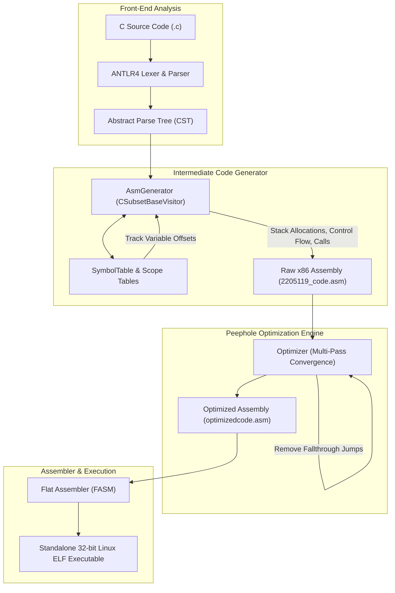

# 32-bit x86 Intermediate Code Generator & Peephole Optimizer

[](https://en.cppreference.com/w/cpp/17)
[](https://www.antlr.org/)
[](https://flatassembler.net/)
[]()
[]()
[](LICENSE)

An end-to-end optimizing compiler back-end that translates a subset of the **C programming language** into executable **32-bit x86 Linux assembly for the Flat Assembler (FASM)**. Developed using **ANTLR4** (C++ target) and the **Visitor Pattern**, featuring dynamic stack-frame activation records, caller-callee calling conventions, short-circuit boolean evaluation, and multi-pass peephole optimizations.

Developed for **CSE 310: Compiler Sessional**, Department of Computer Science & Engineering, Bangladesh University of Engineering & Technology (BUET).

---

## Architecture Overview



---

## Two-Phase Implementation Strategy

Per the official course guidelines ([P1_Grammar.pdf](docs/P1_Grammar.pdf) and [Specification](docs/CSE_310_Januay_2026_ICG_Spec.pdf)), the project is split into two distinct, independently runnable phases:

| Feature / Capability | Phase 1 (`phase1/`) | Phase 2 (`phase2/`) |
| :--- | :---: | :---: |
| **Grammar Rules** | Highlighted rules in `P1_Grammar.pdf` | Full C subset grammar |
| **Arithmetic Expressions** | `+`, `-`, `*`, `/`, `%`, unary `+`, `-` | `+`, `-`, `*`, `/`, `%`, unary `+`, `-` |
| **Variable Scope** | Global data segment & local stack | Global data segment & local stack |
| **Array Addressing** | Basic declarations | Full multidimensional/scaled array indexing |
| **Control Flow** | None (sequential blocks only) | `if`, `if-else`, `for`, `while` loops |
| **Functions & Recursion** | Single `main()` procedure | Full user-defined functions & recursion |
| **Parameter Passing** | N/A | Reverse stack push (`cdecl`-style) |
| **Short-Circuit Logic** | Basic Boolean expressions | Optimized short-circuit jump logic |
| **Peephole Optimizer** | Single-pass redundant push/pop & move removal | Multi-pass (up to 20 passes) convergence |
| **Console Output** | `println(ID)` | `println(ID)` |

---

## Repository Structure

```
.
├── phase1/                                # Phase 1: Expressions, Assignments & Basic Output
│   ├── grammar/
│   │   ├── CSubset.g4                     # Phase 1 grammar subset
│   │   └── Lexer.g4                       # Lexer specifications
│   ├── include/                           # C++ headers (AsmGenerator, Optimizer, SymbolTable)
│   ├── src/                               # Source implementations
│   ├── test/                              # Phase 1 test cases (input.c, test_expressions.c)
│   ├── Makefile                           # Dedicated Phase 1 Makefile
│   ├── build.sh                           # Build & test script
│   └── README.md                          # Phase 1 documentation
├── phase2/                                # Phase 2: Full C Subset with Control Flow & Recursion
│   ├── grammar/
│   │   ├── CSubset.g4                     # Complete C subset grammar
│   │   └── Lexer.g4                       # Lexer specifications
│   ├── include/                           # C++ headers
│   ├── src/                               # Source implementations
│   ├── test/                              # 12 benchmark test cases & golden output.txt
│   ├── Makefile                           # Dedicated Phase 2 Makefile
│   ├── build.sh                           # Build & test script
│   └── README.md                          # Phase 2 documentation
├── docs/
│   ├── CSE_310_Januay_2026_ICG_Spec.pdf   # Official Assignment 4 specification
│   ├── P1_Grammar.pdf                     # Phase 1 highlighted grammar specification
│   └── compare_asm.sh                     # Assembly output comparator script
├── submission/                            # Original unbundled submission directories & archives
│   ├── 2205119_P1/
│   ├── 2205119_P1.zip
│   ├── 2205119_P2/
│   └── 2205119_P2.zip
├── Makefile                               # Top-level master Makefile
├── build.sh                               # Top-level master build & test script
├── .gitignore                             # Ignores generated code, binaries, asm, and >100MB files
└── README.md                              # This file
```

> [!NOTE]
> Large binary zip resources (>100MB) are excluded via `.gitignore` to comply with GitHub's file limit constraints.

---

## Technical Highlights

### 1. Activation Record & Stack Frame Management
- **Standard Prologue & Epilogue**:
  ```assembly
  push ebp
  mov  ebp, esp
  sub  esp, <local_bytes>   ; dynamic stack allocation for local variables
  ...
  mov  esp, ebp
  pop  ebp
  ret
  ```
- **Parameter Offsets**: Function parameters are pushed in reverse order by the caller and referenced as positive offsets from `ebp` (`[ebp + 8 + 4*i]`).
- **Local Variable Offsets**: Managed dynamically with negative offsets (`[ebp - offset]`).
- **Recursive Calling**: Correct activation record setup allows arbitrary recursion depths (tested with recursive factorial and Fibonacci).

### 2. Multi-Pass Peephole Optimization
The optimizer runs successive passes until no further transformations occur (or 20 iterations):
- **Redundant Move Removal**: Eliminates `mov eax, eax` and consecutive writes of identical values to the same destination.
- **Push-Pop Inversion**: Replaces `push reg` immediately followed by `pop reg` with a direct no-op.
- **Algebraic Identities**: Automatically removes `add reg, 0`, `sub reg, 0`, and `imul reg, 1`.
- **Fallthrough Branch Removal**: Deletes unconditional jumps targeting the immediately following label (`jmp L1` followed by `L1:`).

---

## Prerequisites

- **C++ Compiler**: GCC `g++` (version 9+ supporting C++17)
- **ANTLR4 Runtime**: `libantlr4-runtime-dev` (4.13.x)
- **Assembler**: [Flat Assembler (FASM)](https://flatassembler.net/) (`fasm` executable in PATH)
- **Build System**: GNU Make

---

## Build & Test Instructions

### 1. Build Both Phases
```bash
make all
```

### 2. Run Comprehensive Test Suite (All 14 Tests)
```bash
make test
```
Or execute the master build script:
```bash
./build.sh
```

### 3. Test Individual Phases
```bash
make test-p1     # Runs Phase 1 tests
make test-p2     # Runs Phase 2 tests (12 benchmarks against golden output.txt)
```

### 4. Clean All Generated Files
```bash
make clean
```

---

## Verification & Benchmark Summary

### Phase 1 Verification
- `test/input.c`: Variable expressions and assignments evaluated correctly. Assembled with FASM, execution outputs matched golden reference.
- `test/test_expressions.c`: Complex multi-operator evaluation verified.

### Phase 2 Verification (12 Benchmarks)
All 12 benchmarks compiled, assembled with FASM, and verified:
- **Exact Output Match**: `test1_i.c` through `test7_i.c`, `recursion1_i.c`, `recursion2_i.c`.
- **Execution & Assembly Success**: `func.c`, `loop.c`, `exp.c`.

---

## Author
- **Saif (2205119)** - Department of Computer Science & Engineering, BUET
