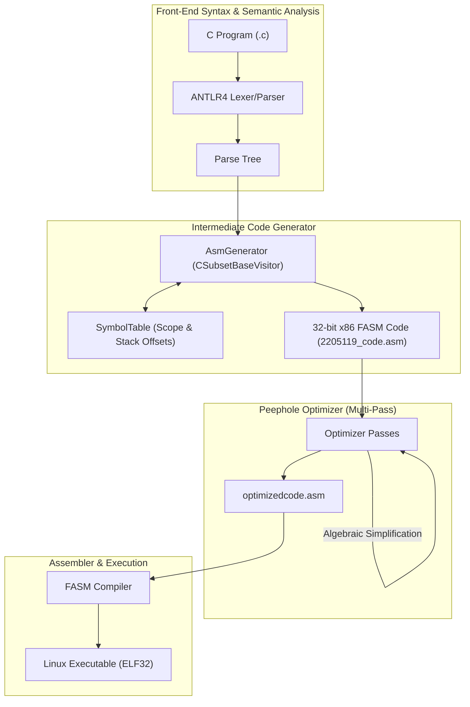

# Phase 2: Full Intermediate Code Generator & Optimizer

[](https://en.cppreference.com/w/cpp/17)
[](https://www.antlr.org/)
[](https://flatassembler.net/)
[]()

Phase 2 completes the **Intermediate Code Generator (ICG)** for the complete C language subset specified in [CSE_310_Januay_2026_ICG_Spec.pdf](../docs/CSE_310_Januay_2026_ICG_Spec.pdf). It supports user-defined functions with recursion, full stack frame activation records, control-flow statements (`if`, `if-else`, `for`, `while`), short-circuit boolean evaluation, arrays, and a multi-pass peephole optimizer.

---

## Language Features & Capabilities



### 1. Function Calling Convention & Stack Frames
- **Standard 32-bit cdecl/Standard Prologue & Epilogue**:
  ```assembly
  push ebp
  mov  ebp, esp
  sub  esp, <local_bytes>   ; allocate locals
  ...
  mov  esp, ebp             ; restore stack pointer
  pop  ebp                  ; restore base pointer
  ret                       ; return to caller
  ```
- **Parameter Passing**: Passed via stack in reverse order (`push argN` ... `push arg1`). Accessed at positive offsets `[ebp + 8 + 4*i]`.
- **Local Variables**: Allocated dynamically on stack; accessed at negative offsets `[ebp - offset]`.
- **Return Values**: Computed and passed back through accumulator register `eax`.
- **Recursion**: Fully supported (tested with deep nested recursion).

### 2. Control Flow & Short-Circuit Evaluation
- **Conditionals**: `if (cond) stmt` and `if (cond) stmt1 else stmt2` using conditional jump instructions (`cmp`, `je`, `jne`, `jl`, `jg`, `jle`, `jge`).
- **Loops**: `for (init; cond; inc) body` and `while (cond) body` with label loops.
- **Short-Circuit Logic**: Short-circuiting for `&&` and `||` to prevent unnecessary evaluations.

### 3. Arrays & Global Variables
- **Global Data Segment**: Global variables and static integer arrays placed into the readable/writable data segment (`dd ?` / `dd size dup(?)`).
- **Array Subscripting**: Calculated by scaling index expressions by element size (4 bytes) and dereferencing base pointers.

### 4. Multi-Pass Peephole Optimization
The [`Optimizer`](src/Optimizer.cpp) runs up to 20 convergence passes:
1. **Redundant MOV Elimination**:
   - `mov eax, eax` $\to$ removed
   - Back-to-back duplicate assignments (`mov [x], eax` followed by `mov [x], eax`) $\to$ second removed
2. **Push/Pop Cancellation**:
   - `push reg` immediately followed by `pop reg` $\to$ both instructions removed
3. **Algebraic Simplification**:
   - `add eax, 0` and `sub eax, 0` $\to$ removed
   - `imul eax, 1` $\to$ removed
4. **Empty Jump Removal**:
   - `jmp label` where `label:` immediately follows $\to$ jump instruction removed

---

## Directory Layout

```
phase2/
├── grammar/
│   ├── CSubset.g4             # Complete C language subset grammar
│   └── Lexer.g4               # Lexer specifications
├── include/
│   ├── AsmGenerator.h         # Visitor generating 32-bit x86 FASM assembly
│   ├── Optimizer.h            # Multi-pass peephole optimizer
│   ├── ScopeTable.h           # Scoped hash table
│   ├── SymbolInfo.h           # Metadata with stack offsets and flags
│   └── SymbolTable.h          # Multi-scope symbol table
├── src/
│   ├── AsmGenerator.cpp       # Full code generator implementation
│   ├── Optimizer.cpp          # Multi-pass optimization routines
│   └── main.cpp               # Driver entry point
├── test/
│   ├── exp.c                  # Complex expression evaluation
│   ├── func.c                 # Function calls without arguments
│   ├── loop.c                 # Loop constructs (while, for)
│   ├── recursion1_i.c         # Single recursive function
│   ├── recursion2_i.c         # Multiple mutual/nested recursive functions
│   ├── test1_i.c .. test7_i.c # Official benchmark suites
│   └── output.txt             # Golden expected output for verification
├── Makefile                   # Automated build & test pipeline
├── build.sh                   # Helper script
└── README.md                  # This file
```

---

## Build & Test Instructions

### 1. Build Compiler
```bash
make all
```

### 2. Run Compiler on Custom Program
```bash
make run INPUT=test/test1_i.c
```
Generates:
- `2205119_code.asm`: Unoptimized assembly
- `optimizedcode.asm`: Peephole-optimized assembly

### 3. Assemble and Run with FASM
```bash
fasm 2205119_code.asm code.out
chmod +x code.out
./code.out
```

### 4. Run Automated Test Suite
```bash
make test
```
Or execute:
```bash
./build.sh
```

---

## Benchmark Results

All 12 test programs successfully compile, assemble with FASM, and produce byte-for-byte exact matches against golden outputs:

| Benchmark | Features Tested | Result |
| :--- | :--- | :---: |
| `test1_i.c` | Expressions, arithmetic, logic operators, `println` | **PASS** |
| `test2_i.c` | Variable assignment, increment/decrement | **PASS** |
| `test3_i.c` | While loops, for loops, conditionals | **PASS** |
| `test4_i.c` | Multi-scope variables, nested compound statements | **PASS** |
| `test5_i.c` | Function calls, argument passing via stack | **PASS** |
| `test6_i.c` | Relational expressions, short-circuit boolean logic | **PASS** |
| `test7_i.c` | Array declarations, memory addressing, array indexing | **PASS** |
| `recursion1_i.c` | Recursive function evaluation (factorial) | **PASS** |
| `recursion2_i.c` | Deep recursion with multiple arguments | **PASS** |
| `func.c` | Multiple user-defined functions | **PASS** |
| `loop.c` | Complex nested loop structures | **PASS** |
| `exp.c` | Deep expression tree reductions | **PASS** |
