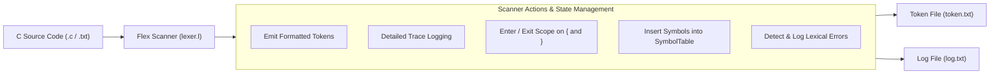

# Lexical Analyzer using Flex & Scoped Symbol Table

[](https://en.cppreference.com/w/cpp/17)
[](https://github.com/westes/flex)
[](Makefile)
[](test/)
[](https://ubuntu.com/)
[](https://cse.buet.ac.bd/)

A robust, high-performance **Lexical Analyzer (Scanner)** for a C language subset built with **Flex** (Fast Lexical Analyzer Generator) and integrated with an open-chaining **Hierarchical Symbol Table** in C++17.

Developed for **CSE 310: Compiler Sessional**, Department of Computer Science and Engineering, Bangladesh University of Engineering and Technology (BUET).

---

## Table of Contents

- [Overview](#overview)
- [Architecture & Workflow](#architecture--workflow)
- [Lexical Specifications](#lexical-specifications)
  - [1. Keywords](#1-keywords)
  - [2. Constants & Literals](#2-constants--literals)
  - [3. Identifiers](#3-identifiers)
  - [4. Operators & Punctuators](#4-operators--punctuators)
  - [5. String Literals](#5-string-literals)
  - [6. Comments](#6-comments)
- [Lexical Error Detection](#lexical-error-detection)
- [Output Specifications](#output-specifications)
- [Repository Structure](#repository-structure)
- [Building & Running](#building--running)
  - [Prerequisites](#prerequisites)
  - [Build with Make](#build-with-make)
  - [Build with Shell Script](#build-with-shell-script)
  - [Automated Verification](#automated-verification)
- [License & Academic Integrity](#license--academic-integrity)

---

## Overview

Lexical analysis represents the **first phase of a compiler**. It transforms a raw source stream of characters into a categorized stream of meaningful **tokens**, while stripping whitespace, logging lexical events, handling scope transitions, and isolating syntactic/lexical anomalies.

### Key Highlights
- **Full C-Subset Grammar:** Recognizes 20 keywords, multiple numeric representations (integer, standard float, scientific notation), character escapes, single-/multi-line strings, and comments.
- **Hierarchical Symbol Table Integration:** Dynamically manages lexical scopes. Curly braces (`{` and `}`) push and pop nested scope tables (`1`, `1.1`, `1.1.1`), logging table states (non-empty buckets) on identifier and constant insertions.
- **Escape Sequence Resolution:** Automatically translates ASCII escape characters (`\n`, `\t`, `\r`, `\\`, `\'`, `\"`, `\a`, `\f`, `\b`, `\v`, `\0`) to their true character codes in output tokens.
- **Exhaustive Error Reporting:** Pinpoints exact line numbers for 9 distinct categories of lexical errors without crashing or halting tokenization.
- **100% Test Benchmark Compliance:** Validated byte-for-byte against the official BUET CSE 310 test suite.

---

## Architecture & Workflow



---

## Lexical Specifications

### 1. Keywords
Keywords are recognized as standalone tokens and are **not** inserted into the symbol table:

| Keyword | Token | Keyword | Token | Keyword | Token | Keyword | Token |
|---|---|---|---|---|---|---|---|
| `if` | `<IF>` | `else` | `<ELSE>` | `for` | `<FOR>` | `while` | `<WHILE>` |
| `do` | `<DO>` | `break` | `<BREAK>` | `int` | `<INT>` | `char` | `<CHAR>` |
| `float` | `<FLOAT>` | `double` | `<DOUBLE>` | `void` | `<VOID>` | `return` | `<RETURN>` |
| `switch` | `<SWITCH>` | `case` | `<CASE>` | `default` | `<DEFAULT>` | `continue` | `<CONTINUE>` |
| `goto` | `<GOTO>` | `long` | `<LONG>` | `short` | `<SHORT>` | `static` | `<STATIC>` |
| `unsigned` | `<UNSIGNED>` | | | | | | |

---

### 2. Constants & Literals
Constants are emitted as `<TYPE, Lexeme>` and inserted into the symbol table:

- **Integer Constants (`CONST_INT`):** Consecutive digits (`0-9`), e.g., `672`, `50`.
- **Floating Point Constants (`CONST_FLOAT`):** Numbers with fractions or exponents, e.g., `3.14159`, `67.2E-3`, `.314159`, `11E-11`.
- **Character Constants (`CONST_CHAR`):** Single character or valid escape sequence enclosed in single quotes (`'p'`, `'\n'`, `'\r'`, `'\t'`, `'\\'`, `'\''`). Escape sequences are resolved to their single character representation in token output.

---

### 3. Identifiers
- Emitted as `<ID, Lexeme>` and inserted into the current scope table.
- Pattern: `[a-zA-Z_][a-zA-Z0-9_]*`
- If an identifier already exists in the current scope, an appropriate already-exists warning is logged instead of creating a duplicate entry.

---

### 4. Operators & Punctuators

| Operator / Punctuator | Token Type | Action |
|---|---|---|
| `+`, `-` | `ADDOP` | Emitted |
| `*`, `/`, `%` | `MULOP` | Emitted |
| `++`, `--` | `INCOP` | Emitted |
| `<`, `<=`, `>`, `>=`, `==`, `!=` | `RELOP` | Emitted |
| `=` | `ASSIGNOP` | Emitted |
| `&&`, `\|\|` | `LOGICOP` | Emitted |
| `!` | `NOT` | Emitted |
| `(` , `)` | `LPAREN`, `RPAREN` | Emitted |
| `{` | `LCURL` | Emitted & triggers `table.enter_scope()` |
| `}` | `RCURL` | Emitted & triggers `table.exit_scope()` |
| `[` , `]` | `LTHIRD`, `RTHIRD` | Emitted |
| `,` | `COMMA` | Emitted |
| `;` | `SEMICOLON` | Emitted |
| `:` | `COLON` | Emitted |

---

### 5. String Literals
- Emitted as `<STRING, processed_string>` in the token file and logged.
- **Single-line strings:** `"This is a string"`
- **Multi-line strings:** Strings containing a trailing `\` before a line break continue onto subsequent lines without emitting a newline token:
  ```c
  "This is a \
  multiline \
  string"
  ```
- All embedded escape characters (`\n`, `\t`, `\"`, etc.) are resolved to actual character codes.

---

### 6. Comments
Comments are recognized, tracked for line numbering, and logged in the log file, but produce **no token** in the token file:
- **Single-line comments:** `// ...` (can continue to the next line if ending with `\`).
- **Multi-line comments:** `/* ... */` (can span arbitrary lines).

---

## Lexical Error Detection

The scanner detects and logs each of the following errors along with the line number where the error originated:

1. **Too many decimal points:** e.g., `127.0.0.1`, `1.2.345.789`
2. **Ill-formed number:** e.g., `23E-1.2`, `5E7.2`
3. **Invalid prefix on ID or invalid suffix on Number:** e.g., `123_bcd`
4. **Multi character constant error:** e.g., `'na'`, `'ab cd'`
5. **Unterminated character:** e.g., `'\t`, `'`, `\'`
6. **Empty character constant error:** `''`
7. **Unterminated string:** `"abcd` (single or multi-line without closing quote)
8. **Unterminated comment:** `/**abc def` (comment without closing `*/`)
9. **Unrecognized character:** Characters outside the C alphabet, e.g., `#`, `$`, `@`

---

## Output Specifications

The analyzer produces two output files:
1. **Token File (`token.txt`):** A space-separated sequence of generated tokens:
   ```text
   <INT> <ID, main> <LPAREN, (> <RPAREN, )> <LCURL, {> <INT> <ID, _i> <ASSIGNOP, => <CONST_INT, 672> ...
   ```
2. **Log File (`log.txt`):** Chronological log of all token matches, lexemes, symbol table state dumps on insertions, error messages, and summary line/error counts:
   ```text
   Line no 1: Token <INT> Lexeme int found

   Line no 1: Token <ID> Lexeme main found

   ScopeTable # 1
   6 --> < main : ID >
   ...
   Total lines: 19
   Total errors: 18
   ```

---

## Repository Structure

```
.
├── include/                     # C++ Header files
│   ├── SymbolInfo.h             # Symbol token representation
│   ├── ScopeTable.h             # Open hash table with non-empty bucket dumping
│   └── SymbolTable.h            # Hierarchical scope management
├── src/                         # Flex source code
│   └── lexer.l                  # Complete Lexical Analyzer definition
├── test/                        # Benchmark test suite
│   ├── input1.txt               # Valid C program with expressions & scoping
│   ├── input1_token.txt         # Expected tokens for input1
│   ├── input1_log.txt           # Expected log for input1
│   ├── input2.txt               # String literal and multi-line tests
│   ├── input2_token.txt         # Expected tokens for input2
│   ├── input2_log.txt           # Expected log for input2
│   ├── input3.txt               # Comprehensive lexical error suite
│   ├── input3_token.txt         # Expected tokens for input3
│   └── input3_log.txt           # Expected log for input3
├── docs/                        # Specifications & lecture resources
│   ├── Assignment on Lexical Analysis.pdf
│   ├── Lexical Analysis Lecture.pptx
│   └── Lexical_Analysis_Assignment_Plan.md
├── submission/                  # Archived academic submission package
│   ├── 2205119/                 # Clean Moodle submission folder
│   └── 2205119.zip              # Submission zip archive
├── Makefile                     # Standard GNU Make build rules
├── build.sh                     # Automated build script
├── .gitignore                   # Ignores binaries and generated outputs
└── README.md                    # Project documentation
```

---

## Building & Running

### Prerequisites
- **Flex:** Fast Lexical Analyzer Generator (`sudo apt install flex`)
- **C++ Compiler:** GCC $\ge$ 9.0 or Clang with C++17 support
- **Build Tools:** GNU `make` and `bash`

### Build with Make

```bash
# Build the lexer binary
make

# Run against default test file (input1.txt)
make run

# Run full test suite (input1, input2, input3) and verify against golden outputs
make test

# Clean all generated files and binaries
make clean
```

### Build with Shell Script

```bash
chmod +x build.sh
./build.sh [input_file.txt] [optional_token_out.txt] [optional_log_out.txt]
```

### Manual Compilation

```bash
# 1. Generate C source using Flex
flex -o src/lex.yy.c src/lexer.l

# 2. Compile with C++17 and include directory
g++ -std=c++17 -Wall -Wextra -Iinclude src/lex.yy.c -o lexer

# 3. Execute
./lexer test/input1.txt token.txt log.txt
```

### Automated Verification

To verify that the output matches the official BUET CSE 310 benchmark:
```bash
make test
```
**Output:**
```
--- Testing input1 ---
Test 1 Tokens: PASSED
Test 1 Logs: PASSED
--- Testing input2 ---
Test 2 Tokens: PASSED
Test 2 Logs: PASSED
--- Testing input3 ---
Test 3 Tokens: PASSED
Test 3 Logs: PASSED
All 3 test cases passed with 100% exact match!
```

---

## License & Academic Integrity

This project is part of the academic curriculum for **CSE 310 (Compiler Sessional)** at BUET. It is made available for educational and portfolio demonstration purposes.
