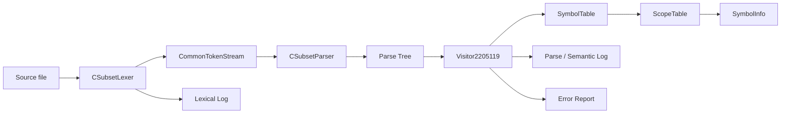

# C-Subset Semantic Analyzer

> A compiler front-end for a deliberately restricted subset of C, implemented with **ANTLR4** and **C++17**. The project performs lexical analysis, parsing, scoped symbol-table management, semantic/type checking, parse-rule logging, and regression testing against supplied reference outputs.

## Table of Contents

- [Overview](#overview)
- [What the Project Does](#what-the-project-does)
- [Compiler Pipeline](#compiler-pipeline)
- [Supported Language Subset](#supported-language-subset)
- [Semantic Checks](#semantic-checks)
- [Project Structure](#project-structure)
- [Core Components](#core-components)
- [Prerequisites](#prerequisites)
- [Environment Setup](#environment-setup)
- [Build and Run](#build-and-run)
- [Testing](#testing)
- [Generated Output](#generated-output)
- [Understanding the Test Cases](#understanding-the-test-cases)
- [Symbol Table Design](#symbol-table-design)
- [Type System and Semantic Rules](#type-system-and-semantic-rules)
- [Development Workflow](#development-workflow)
- [Troubleshooting](#troubleshooting)
- [Known Limitations](#known-limitations)
- [Extending the Project](#extending-the-project)
- [References](#references)

---

## Overview

This repository implements the **front-end analysis stages of a small C-like language**. Source programs are tokenized by an ANTLR lexer, parsed using an ANTLR grammar, and then traversed with a custom C++ visitor. During traversal, the visitor builds and queries nested symbol tables, infers expression types, validates declarations and function calls, and writes semantic diagnostics.

The project is best understood as a **compiler construction / semantic analysis project**, not as a complete C compiler. It does **not** generate assembly, machine code, LLVM IR, or executable programs.

### Main capabilities

- Lexical analysis with token logging
- Parsing of a restricted C-like grammar
- ANTLR4 parse-tree traversal using the visitor pattern
- Nested lexical scopes
- Hash-table-based symbol management
- Variable, array, and function metadata
- Function declaration/definition consistency checking
- Expression type propagation
- Semantic error detection
- Targeted handling of selected malformed syntax
- Single-file and five-file batch execution modes
- Regression testing against reference output

---

## What the Project Does

Given a C-subset source file, the program performs the following high-level work:

1. Reads the source file.
2. Runs the ANTLR-generated lexer.
3. Logs recognized lexical tokens.
4. Builds a token stream.
5. Parses the stream starting from the grammar rule `start`.
6. Traverses the parse tree using `Visitor2205119`.
7. Creates and destroys nested scopes as required.
8. Inserts identifiers into a custom symbol table.
9. Checks declarations, types, arrays, function signatures, arguments, and expressions.
10. Writes parse/semantic logs and semantic error reports.

The five supplied sample programs are also used as regression tests.

---

## Compiler Pipeline



### Runtime flow in `main.cpp`

For every input file, `main.cpp` creates:

```text
ANTLRInputStream
    -> CSubsetLexer
    -> CommonTokenStream
    -> CSubsetParser
    -> parser.start()
    -> Visitor2205119::visit(...)
```

The lexer uses the global `lexLogFile` stream, while the visitor owns the parser/semantic log and error streams.

---

## Supported Language Subset

The grammar supports a controlled subset of C syntax.

### Types

```c
int
float
void
```

`void` is meaningful for functions but is rejected for variable declarations by the semantic analyzer.

### Variables

```c
int x;
float value;
int a, b, c;
```

### Fixed-size arrays

```c
int numbers[10];
float values[5];
```

Array sizes in declarations are integer constants.

### Function declarations

```c
int add(int a, int b);
void foo();
```

### Function definitions

```c
int add(int a, int b) {
    return a + b;
}
```

### Statements

The grammar includes:

- Variable declarations
- Expression statements
- Compound statements / blocks
- `if`
- `if ... else`
- `for`
- `while`
- Simplified `printf(identifier);`
- `return expression;`

### Expressions

Supported expression categories include:

- Assignment
- Arithmetic addition/subtraction
- Multiplication/division/modulus
- Relational expressions
- Logical expressions
- Unary `+` / `-`
- Logical NOT `!`
- Array access
- Function calls
- Integer and floating-point constants
- Postfix increment and decrement

Examples:

```c
x = 2;
y = x - 5;
a[1] = 5;
i = a[0] + a[1];
j = 2 * 3 + (5 % 3 < 4 && 8) || 2;
d = add(1, 2 * 3) + 3.5 * 2;
```

---

## Semantic Checks

The custom visitor performs semantic analysis beyond ordinary grammar recognition.

### Declaration checks

- Multiple declarations in the same scope
- Duplicate parameter names
- Variables declared with `void`
- Conflicts between variable and function identifiers
- Multiple function definitions

### Identifier checks

- Use of undeclared variables
- Calls to undeclared functions
- Attempting to call a non-function identifier

### Array checks

- Indexing a non-array variable
- Using a non-integer array index
- Using an entire array where a scalar value is expected
- Assigning directly to an array identifier instead of an element

### Function checks

- Declaration/definition return-type mismatch
- Declaration/definition parameter-count mismatch
- Declaration/definition parameter-type mismatch
- Function-call argument-count mismatch
- Function-call argument-type mismatch

The implementation permits an `int` argument where a `float` parameter is expected, but rejects a `float` argument where an `int` parameter is expected.

### Expression checks

- `float` assigned to `int`
- Incompatible return expression types
- `void` function used as a value in an expression
- Non-integer operands with `%`
- Literal modulus by zero
- `float` condition in `if`
- `float` condition in `while`

### Selected syntax-recovery checks

The grammar deliberately contains a few alternatives for recognizing particular malformed constructs so that the visitor can report assignment-specific messages, including cases similar to:

```c
int x-y;
a = 2 + = 6
```

It also reports missing semicolons for expression statements recognized by the corresponding grammar alternative.

> These checks are targeted recovery rules, not a complete replacement for ANTLR's parser error handling.

---

## Project Structure

```text
2205119/
├── main.cpp
├── 2205119_visitor.cpp
├── 2205119_visitor.h
├── 2205119_symbol_info.h
├── 2205119_scope_table.h
├── 2205119_symbol_table.h
│
├── Lexer.g4
├── CSubset.g4
│
├── run-script.sh
├── test-all.sh
├── compare.sh
├── clean-script.sh
│
├── .antlr/
│   ├── CSubsetParser.java
│   ├── CSubsetLexer.java
│   ├── CSubsetListener.java
│   ├── CSubsetBaseListener.java
│   ├── *.tokens
│   └── *.interp
│
├── sample_input/
│   ├── input1.txt
│   ├── input2.txt
│   ├── input3.txt
│   ├── input4.txt
│   └── input5.txt
│
├── sample_output/
│   ├── log/
│   │   ├── log1.txt
│   │   └── ... log5.txt
│   └── error/
│       ├── error1.txt
│       └── ... error5.txt
│
└── comparison_diffs/
```

After a batch run, the following generated directory is created:

```text
output/
├── log/
│   ├── log1.txt
│   └── ... log5.txt
├── error/
│   ├── error1.txt
│   └── ... error5.txt
└── lex/
    ├── lexLog1.txt
    └── ... lexLog5.txt
```

ANTLR also generates C++ parser/lexer/visitor support files in the project root during the build, for example:

```text
CSubsetLexer.cpp
CSubsetLexer.h
CSubsetParser.cpp
CSubsetParser.h
CSubsetBaseVisitor.cpp
CSubsetBaseVisitor.h
CSubsetVisitor.cpp
CSubsetVisitor.h
CSubset.tokens
CSubset.interp
...
```

### Important note about `.antlr/`

The checked-in `.antlr/` directory contains Java-side generated ANTLR artifacts. The provided build script does **not** compile those Java sources. `run-script.sh` regenerates the grammar for the **C++ target** in the repository root and compiles those generated C++ sources.

---

## Core Components

### `Lexer.g4`

Defines lexical tokens for:

- Keywords
- Operators
- Punctuation
- Identifiers
- Integer constants
- Floating-point constants
- Comments
- String literals

Whitespace is skipped. Comments and strings are also skipped from the parser token stream after being written to the lexical log.

Each recognized token is logged using an embedded C++ lexer action.

### `CSubset.g4`

Defines the parser grammar and imports `Lexer.g4`.

The root grammar rule is:

```antlr
start : program ;
```

The grammar describes global variables, functions, parameters, statements, expressions, arrays, control flow, function calls, and selected malformed constructs.

### `main.cpp`

Acts as the program entry point.

It supports two modes:

```text
compiler.out <input_file>
```

and

```text
compiler.out <input1> <input2> <input3> <input4> <input5>
```

In single-input mode it writes:

```text
log.txt
error.txt
lexLogFile.txt
```

In five-input mode it writes per-test outputs under `output/`.

### `2205119_visitor.cpp` / `.h`

Implements `Visitor2205119`, derived from the ANTLR-generated `CSubsetBaseVisitor`.

Responsibilities include:

- Parse-tree traversal
- Rule-by-rule logging
- Type propagation
- Semantic validation
- Scope management
- Function signature validation
- Array validation
- Error counting

The final log contains the total source line count and total semantic error count.

### `2205119_symbol_info.h`

Represents one symbol.

Stored metadata includes:

- Name
- Symbol type
- Linked-list `next` pointer
- Array flag and size
- Function flag
- Function return type
- Parameter types
- Parameter names
- Declared state
- Defined state

### `2205119_scope_table.h`

Represents one lexical scope using a hash table with separate chaining.

Each scope receives a hierarchical ID such as:

```text
1
1.1
1.2
1.2.1
```

The table supports insertion, lookup, deletion, and printing.

### `2205119_symbol_table.h`

Maintains the current scope and the chain of parent scopes.

Operations include:

- Enter scope
- Exit scope
- Insert into current scope
- Remove from current scope
- Lookup through current and parent scopes
- Print current/all accessible scopes

### Shell scripts

| Script | Purpose |
|---|---|
| `run-script.sh` | Regenerates ANTLR C++ sources, compiles the project, and runs all five sample inputs. |
| `test-all.sh` | Runs the full build/batch process and then executes regression comparison. |
| `compare.sh` | Compares generated parser/semantic logs and errors with `sample_output/`. |
| `clean-script.sh` | Removes the runtime `output/` directory and selected generated root-level files. |

---

## Prerequisites

The existing build script expects a Unix-like development environment.

### Required tools

- **Bash**
- **C++17 compiler** (`g++`)
- **ANTLR 4.13.2 tool**
- **ANTLR4 C++ runtime 4.13.2**
- **Python 3** if using `antlr4-tools`
- **Java 11+** when running the ANTLR tool directly from its JAR
- Standard Unix tools such as `diff`, `cmp`, `rm`, and `mkdir`

### Paths expected by `run-script.sh`

```bash
ANTLR_VERSION="4.13.2"
ANTLR_INCLUDE="/usr/local/include/antlr4-runtime"
ANTLR_LIB="/usr/local/lib"
```

If your ANTLR C++ runtime is installed somewhere else, update `ANTLR_INCLUDE` and `ANTLR_LIB` in `run-script.sh` before building.

### Recommended platform

For the repository exactly as written, **Linux or WSL** is the simplest environment. Native Windows builds are possible, but the included Bash scripts and `/usr/local/...` paths are Unix-oriented.

---

## Environment Setup

The following setup is intended for Ubuntu/WSL or a similar Debian-based Linux environment.

### 1. Install basic development tools

```bash
sudo apt update
sudo apt install -y \
    build-essential \
    cmake \
    ninja-build \
    git \
    python3 \
    python3-pip \
    default-jre
```

Verify:

```bash
g++ --version
cmake --version
python3 --version
java -version
```

### 2. Install the ANTLR command-line tool

The easiest way to obtain an `antlr4` command is `antlr4-tools`:

```bash
python3 -m pip install --user antlr4-tools
```

If the command is not found afterward, add the user-level Python scripts directory to `PATH` for your shell.

Verify the exact version used by this project:

```bash
antlr4 -v 4.13.2
```

The repository's `run-script.sh` uses that version-selection syntax.

### 3. Install the ANTLR4 C++ runtime

The generated parser is C++, so the ANTLR tool alone is not enough. The C++ runtime library must also be available.

A source installation matching the script's `/usr/local` paths can be performed with:

```bash
cd /tmp
git clone --depth 1 --branch 4.13.2 https://github.com/antlr/antlr4.git antlr4-4.13.2

cmake \
    -S antlr4-4.13.2/runtime/Cpp \
    -B antlr4-4.13.2/build-cpp \
    -G Ninja \
    -DCMAKE_BUILD_TYPE=Release \
    -DCMAKE_INSTALL_PREFIX=/usr/local

cmake --build antlr4-4.13.2/build-cpp
sudo cmake --install antlr4-4.13.2/build-cpp
sudo ldconfig
```

Then verify the paths expected by the project:

```bash
ls /usr/local/include/antlr4-runtime/antlr4-runtime.h
ls /usr/local/lib/libantlr4-runtime*
```

If the library is installed under `/usr/local/lib64`, `/usr/lib`, or another location, edit `ANTLR_LIB` accordingly.

### 4. Make the scripts executable

From the repository root:

```bash
chmod +x run-script.sh test-all.sh compare.sh clean-script.sh
```

### 5. Verify the environment

```bash
command -v antlr4
command -v g++

test -f /usr/local/include/antlr4-runtime/antlr4-runtime.h \
    && echo "ANTLR C++ headers found"

ls /usr/local/lib/libantlr4-runtime* 2>/dev/null
```

At this point, the repository should be ready to build.

---

## Build and Run

### Fastest complete run

```bash
./run-script.sh
```

This script performs three operations:

1. Creates/clears output folders.
2. Regenerates the C++ lexer/parser/visitor support files.
3. Compiles and runs all five sample inputs.

The ANTLR generation command is:

```bash
antlr4 -v 4.13.2 -Dlanguage=Cpp -visitor -no-listener CSubset.g4
```

The project is then compiled using:

```bash
g++ -std=c++17 -w \
    -I/usr/local/include/antlr4-runtime \
    *.cpp \
    -L/usr/local/lib \
    -lantlr4-runtime \
    -pthread \
    -o compiler.out
```

The script finally runs:

```bash
LD_LIBRARY_PATH="/usr/local/lib${LD_LIBRARY_PATH:+:$LD_LIBRARY_PATH}" \
./compiler.out \
    sample_input/input1.txt \
    sample_input/input2.txt \
    sample_input/input3.txt \
    sample_input/input4.txt \
    sample_input/input5.txt
```

### Run a single custom input

First generate and compile the project, either manually or by running `./run-script.sh` once.

Then execute:

```bash
LD_LIBRARY_PATH="/usr/local/lib${LD_LIBRARY_PATH:+:$LD_LIBRARY_PATH}" \
./compiler.out path/to/your_input.txt
```

Single-input mode generates:

```text
log.txt
error.txt
lexLogFile.txt
```

### Manual build

If you want to see every stage explicitly:

```bash
antlr4 -v 4.13.2 -Dlanguage=Cpp -visitor -no-listener CSubset.g4

g++ -std=c++17 -w \
    -I/usr/local/include/antlr4-runtime \
    *.cpp \
    -L/usr/local/lib \
    -lantlr4-runtime \
    -pthread \
    -o compiler.out
```

Then run either single-input or five-input mode.

---

## Testing

### Full regression test

```bash
./test-all.sh
```

`test-all.sh` executes:

```text
run-script.sh
    -> generate
    -> compile
    -> run five samples

compare.sh
    -> compare generated output against sample_output/
```

### Expected successful result

The comparison script checks 10 files:

- Five parser/semantic log files
- Five semantic error files

A successful run ends with a result equivalent to:

```text
Result: 10 passed, 0 failed
All generated log/error files exactly match the samples.
```

### What happens on failure

If a generated file differs from the expected reference, `compare.sh` creates a unified diff in:

```text
comparison_diffs/
```

For example:

```text
comparison_diffs/log2.diff
comparison_diffs/error4.diff
```

`compare.sh` exits with status `1` when any mismatch is found, which makes `test-all.sh` suitable for automated regression checking.

### Important test scope

`compare.sh` compares:

```text
output/log/*
output/error/*
```

It does **not** compare:

```text
output/lex/*
```

Lexical logs are generated for inspection but are not part of the supplied reference comparison.

---

## Generated Output

### Lexical logs

Batch mode:

```text
output/lex/lexLog1.txt
...
output/lex/lexLog5.txt
```

Each lexer token action records information in the form:

```text
Line# <line>: Token <TOKEN_TYPE> Lexeme <text>
```

Comments and string literals are logged and skipped before parsing.

### Parser / semantic logs

Batch mode:

```text
output/log/log1.txt
...
output/log/log5.txt
```

These files contain:

- Grammar-rule traces
- Reconstructed rule text
- Semantic errors as they occur
- Symbol-table snapshots
- Total line count
- Total error count

Typical entries look like:

```text
Line 1: type_specifier : INT

int
```

At the end of a completed parse, the root log includes:

```text
Total lines: <N>
Total errors: <N>
```

### Error files

Batch mode:

```text
output/error/error1.txt
...
output/error/error5.txt
```

Errors use the format:

```text
Error at line <line>: <message>
```

The same semantic error is also copied into the main parser/semantic log.

---

## Understanding the Test Cases

The supplied samples cover both valid programs and intentional errors.

| Input | Primary purpose | Expected semantic-error file |
|---|---|---|
| `input1.txt` | Valid declarations, functions, arrays, arithmetic, logical expressions | Empty |
| `input2.txt` | Duplicate declarations, invalid array usage, type mismatch, invalid modulus, undeclared variable | Contains errors |
| `input3.txt` | Larger valid program with nested scopes, conditionals, loops, function calls | Empty |
| `input4.txt` | Broad semantic-error coverage for functions, arrays, void expressions, types, and undeclared identifiers | Contains errors |
| `input5.txt` | Targeted malformed syntax and missing-semicolon recovery | Contains errors |

Examples of expected diagnostics include:

```text
Multiple declaration of c
Expression inside third brackets not an integer
Non-Integer operand on modulus operator
Undeclared variable b
Return type mismatch with function declaration in function foo3
Void function used in expression
Modulus by Zero
Undeclared function foo5
```

---

## Symbol Table Design

The semantic analyzer implements its own symbol-table stack instead of relying on a standard container alone.

### `SymbolInfo`

Each symbol stores both ordinary identifier data and semantic metadata.

Conceptually:

```text
SymbolInfo
├── name
├── type
├── next
├── isArray
├── arraySize
├── isFunction
├── returnType
├── parameterTypes[]
├── parameterNames[]
├── isDeclared
└── isDefined
```

### `ScopeTable`

Each scope owns a fixed-size hash table.

Current configuration:

```cpp
SymbolTable symbolTable(30, false);
```

Therefore every scope uses **30 buckets**.

Collisions are handled through linked-list chaining using the `next` pointer stored in `SymbolInfo`.

The function named `SDBMHash` currently computes the sum of identifier characters and takes the result modulo the bucket count:

```text
bucket = character_sum(identifier) % number_of_buckets
```

### `SymbolTable`

`SymbolTable` keeps a pointer to the current `ScopeTable`. Every `ScopeTable` stores a pointer to its parent.

Lookup therefore follows lexical scope rules:

```text
current scope
    -> parent scope
        -> parent's parent
            -> ...
                -> global scope
```

Insertion is performed only in the current scope, which permits legal shadowing in nested blocks while still detecting duplicate declarations inside the same scope.

### Function scopes

A new scope is entered for a function definition. Named parameters are inserted into that function scope before the function body is analyzed.

Ordinary nested compound blocks create additional child scopes.

---

## Type System and Semantic Rules

The visitor propagates simplified type strings through expression nodes.

Common values include:

```text
int
float
void
error
int array[N]
float array[N]
```

### Arithmetic promotion

For ordinary arithmetic:

```text
int   op int   -> int
int   op float -> float
float op int   -> float
float op float -> float
```

Arrays are not treated as arithmetic scalar values.

### Assignment

A `float` value cannot be assigned to an `int` variable.

An `int` value can be assigned where a `float` value is expected.

### Relational and logical expressions

Relational operations produce `int`.

Logical operations also produce `int`.

### Modulus

`%` requires both operands to be `int`.

The visitor also detects a literal zero right operand in forms such as:

```c
x % 0
x % +0
x % -0
```

### Function calls

For argument checking:

```text
expected int   + actual float -> error
expected float + actual int   -> accepted
```

Argument count must match the function signature.

### Return statements

The return expression is checked against the currently analyzed function's return type.

### Arrays

An array element expression evaluates to the base element type.

Example:

```text
int a[5]

a       -> int array[5]
a[0]    -> int
```

---

## Development Workflow

A practical development cycle is:

```bash
# 1. Modify grammar or visitor implementation
$EDITOR Lexer.g4 CSubset.g4 2205119_visitor.cpp

# 2. Rebuild and run sample programs
./run-script.sh

# 3. Compare against reference behavior
./compare.sh

# Or perform steps 2 and 3 together
./test-all.sh
```

When changing intended behavior, inspect the generated diff files carefully before updating any reference output.

### Cleaning generated runtime output

```bash
./clean-script.sh
```

The script removes `output/` and selected generated root-level files.

Be aware that it intentionally preserves file types such as `.cpp` and `.h`, so generated ANTLR C++ source/header files may remain after cleaning.

---

## Troubleshooting

### `antlr4: command not found`

Install `antlr4-tools` or configure the official ANTLR JAR as an `antlr4` command.

Check:

```bash
command -v antlr4
antlr4 -v 4.13.2
```

If installed with `pip --user`, ensure the Python user scripts directory is in `PATH`.

---

### `antlr4: error: unrecognized arguments: -v ...`

The repository script expects an `antlr4` launcher that supports version selection through:

```bash
antlr4 -v 4.13.2
```

If your `antlr4` command is instead a direct alias to `java -jar ...`, either install `antlr4-tools` or change this line in `run-script.sh`:

```bash
antlr4 -v "$ANTLR_VERSION" -Dlanguage=Cpp -visitor -no-listener CSubset.g4
```

to a command compatible with your local ANTLR installation, for example a direct Java invocation of the 4.13.2 JAR.

---

### `antlr4-runtime.h: No such file or directory`

The include path does not match the runtime installation.

Current script:

```bash
ANTLR_INCLUDE="/usr/local/include/antlr4-runtime"
```

Find the header:

```bash
find /usr /usr/local -name antlr4-runtime.h 2>/dev/null
```

Then update `ANTLR_INCLUDE`.

---

### `cannot find -lantlr4-runtime`

The linker cannot find the ANTLR C++ runtime library.

Find it:

```bash
find /usr /usr/local -name 'libantlr4-runtime*' 2>/dev/null
```

Then update:

```bash
ANTLR_LIB="..."
```

in `run-script.sh`.

---

### Runtime error: shared library cannot be opened

Example symptom:

```text
error while loading shared libraries: libantlr4-runtime.so: cannot open shared object file
```

Run:

```bash
sudo ldconfig
```

or execute with the correct runtime library directory in `LD_LIBRARY_PATH`.

The included script already does this for `/usr/local/lib`.

---

### Compilation fails after regenerating the grammar

Check that the ANTLR tool version and C++ runtime version are compatible. This repository is explicitly configured around **ANTLR 4.13.2**.

Also verify C++17 support:

```bash
g++ --version
```

and keep:

```bash
-std=c++17
```

in the compile command.

---

### `./run-script.sh: Permission denied`

```bash
chmod +x run-script.sh test-all.sh compare.sh clean-script.sh
```

---

### Tests fail but compilation succeeds

Run:

```bash
./compare.sh
```

Then inspect:

```text
comparison_diffs/
```

The comparison is exact, so changes in whitespace, reconstructed float formatting, rule text, symbol-table output, or diagnostic wording can fail a regression test even if the semantic behavior appears similar.

---

### ANTLR prints parser errors to the terminal but `error.txt` is incomplete

The visitor's `error.txt` output is primarily for semantic errors and selected custom syntax-recovery cases. The project does not install a custom ANTLR syntax-error listener in `main.cpp`, so generic parser recognition errors may still be emitted by ANTLR's default error handling rather than being normalized into the custom error file.

---

## Known Limitations

This is intentionally a C **subset**, and several full-C features are outside its grammar or semantic model.

Notable limitations include:

- No code generation or executable output
- No preprocessor
- No headers or `#include`
- No pointers
- No structs, unions, enums, or typedefs
- No `char`, `double`, `long`, `short`, or signed/unsigned variants
- No declaration initializers such as `int x = 5;`
- No multidimensional array grammar
- No array parameters
- No `switch`, `case`, `break`, `continue`, or `do ... while`
- No general C `printf` format-string grammar; the parser accepts the simplified form `printf(ID);`
- Strings are lexically logged and skipped rather than represented as expression values
- No control-flow analysis for missing returns or unreachable statements
- No constant folding beyond the explicit literal-zero modulus check
- No array bounds checking
- No full C implicit-conversion system
- No custom centralized ANTLR parser-error listener
- `clean-script.sh` is a partial clean and preserves generated `.cpp`/`.h` files
- The build script uses hard-coded Unix installation paths instead of CMake/pkg-config discovery

These constraints are useful to keep in mind when evaluating behavior that differs from a production C compiler.

---

## Extending the Project

Useful next improvements would include:

### 1. Build system

Replace the direct `g++ *.cpp` command with CMake.

Benefits:

- Runtime discovery
- Cross-platform builds
- Explicit generated-source handling
- Better IDE integration
- Cleaner dependency management

### 2. Centralized error listener

Add a custom ANTLR error listener so lexer/parser syntax errors and visitor semantic errors can use one consistent diagnostic format.

### 3. Richer type representation

Replace string-based types such as `"int array[5]"` with a structured type model.

Example:

```text
Type
├── kind: Int | Float | Void | Error
├── isArray
└── arraySize
```

### 4. Better source locations

Store token ranges or source spans with symbols and diagnostics, not only line numbers.

### 5. More complete semantic analysis

Possible additions:

- Array bounds checks for constant indices
- Return-path validation
- Function redeclaration compatibility rules
- Better implicit-conversion rules
- L-value validation
- Constant-expression evaluation

### 6. Continuous integration

The existing `test-all.sh` already returns a failing exit status when regression output differs, making it straightforward to integrate with GitHub Actions.

A CI job would primarily need to:

1. Install ANTLR 4.13.2 and its C++ runtime.
2. Run `./test-all.sh`.
3. Fail the workflow when the script returns non-zero.

---

## References

- ANTLR: https://www.antlr.org/
- ANTLR downloads: https://www.antlr.org/download.html
- ANTLR repository: https://github.com/antlr/antlr4
- ANTLR getting started guide: https://github.com/antlr/antlr4/blob/master/doc/getting-started.md

---

## Summary

This repository demonstrates the core architecture of a compiler front end:

```text
lexing
  -> parsing
    -> parse-tree traversal
      -> nested symbol tables
        -> semantic/type analysis
          -> diagnostics and regression testing
```

For a first run after the environment is configured:

```bash
./test-all.sh
```

For a custom source file:

```bash
./run-script.sh
LD_LIBRARY_PATH="/usr/local/lib${LD_LIBRARY_PATH:+:$LD_LIBRARY_PATH}" \
./compiler.out path/to/your_input.txt
```
