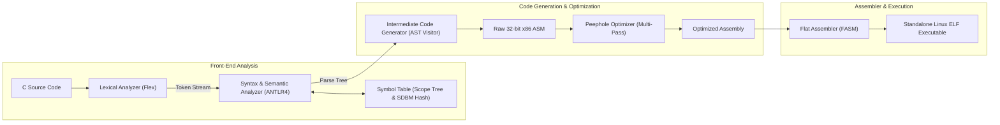

# CSE 310: Compiler Sessional

[](https://en.cppreference.com/w/cpp/17)
[]()
[](https://www.antlr.org/)
[](https://flatassembler.net/)
[]()
[]()
[](LICENSE)

A complete, end-to-end optimizing compiler for a subset of the **C programming language**, targeting **32-bit x86 Linux assembly (Flat Assembler - FASM)**. This repository houses all four course assignments (offlines) developed for **CSE 310 (Compiler Sessional)** at the **Department of Computer Science and Engineering, Bangladesh University of Engineering and Technology (BUET)**.

---

## Compiler Pipeline Architecture



---

## Projects Overview

| Module | Directory | Technology | Key Capabilities |
| :--- | :--- | :--- | :--- |
| **1. Symbol Table** | [`Symbol Table/`](Symbol%20Table) | C++17, SDBM Hash | Dynamic hierarchical scopes (`1`, `1.1`), separate chaining, memory-safe iterative destruction, $O(1)$ expected lookup/insert. |
| **2. Lexical Analyzer** | [`Lexical Analyzer/`](Lexical%20Analyzer) | Flex, C++17 | Tokenizer supporting keywords, constants, identifiers, escape characters, multiline strings/comments, token log stream generation. |
| **3. Syntax & Semantic Analyzer** | [`Syntax and Semantic Analyzer/`](Syntax%20and%20Semantic%20Analyzer) | ANTLR4, C++17, Visitor | AST visitor traversal, type checking, integral modulus check, function declaration/definition parity, division by zero detection. |
| **4. Intermediate Code Generator** | [`Intermediate Code Generator/`](Intermediate%20Code%20Generator) | ANTLR4, FASM, C++17 | Translates C AST into 32-bit x86 Linux assembly. Stack frame management (`ebp`/`esp`), recursion, short-circuit logic, peephole optimization. |

---

## Repository Structure

```
.
├── Symbol Table/                          # Offline 1: Scoped hash-based symbol table
│   ├── include/                           # SymbolInfo, ScopeTable, SymbolTable headers
│   ├── src/main.cpp                       # Interactive command-driven driver
│   ├── test/                              # Test input and golden sample output
│   ├── docs/                              # Assignment specifications & lecture slides
│   ├── Makefile, build.sh, README.md
├── Lexical Analyzer/                      # Offline 2: Flex lexical analyzer
│   ├── src/lexer.l                        # Flex lexical specification rules
│   ├── include/                           # Scoped symbol table integration
│   ├── test/                              # 3 comprehensive test suites & golden logs
│   ├── Makefile, build.sh, README.md
├── Syntax and Semantic Analyzer/          # Offline 3: ANTLR4 syntax & semantic analyzer
│   ├── grammar/                           # CSubset.g4 and Lexer.g4 grammars
│   ├── include/                           # CSubsetVisitorImpl and symbol table headers
│   ├── src/                               # Visitor semantic actions and compiler driver
│   ├── test/                              # 5 test programs, golden logs, and error files
│   ├── Makefile, build.sh, README.md
├── Intermediate Code Generator/           # Offline 4: 32-bit x86 FASM code generator & optimizer
│   ├── phase1/                            # Phase 1: Expressions, assignments, println
│   ├── phase2/                            # Phase 2: Full C subset, functions, recursion, loops
│   ├── docs/                              # Course ICG spec & Phase 1 grammar rules
│   ├── Makefile, build.sh, README.md
├── Makefile                               # Master Makefile across all 4 projects
├── build.sh                               # Master build and verification script
├── .gitignore                             # Global Git ignore rules
└── README.md                              # This file
```

---

## Prerequisites

- **C++ Compiler**: GCC `g++` (version 9+ supporting C++17)
- **Flex**: `flex` lexical analyzer generator
- **ANTLR4 Runtime**: `libantlr4-runtime-dev` (4.13.x installed in `/usr/local/include/antlr4-runtime`)
- **ANTLR Tool**: `antlr4` CLI tool (installed in `PATH` or `/home/saif/.local/bin/antlr4`)
- **Flat Assembler**: `fasm` (Flat Assembler for x86 Linux)
- **Make**: GNU Make

---

## Quick Start & Verification

### 1. Build and Verify All 4 Projects
To build every module and run the full test suite in sequence:
```bash
make test
```
Or execute the master shell script:
```bash
./build.sh
```

### 2. Build Specific Modules
```bash
make symbol-table       # Builds Symbol Table
make lexer              # Builds Lexical Analyzer
make parser             # Builds Syntax and Semantic Analyzer
make icg                # Builds Intermediate Code Generator (Phase 1 & Phase 2)
```

### 3. Test Specific Modules
```bash
make test-symbol-table  # Verifies Symbol Table against golden output
make test-lexer         # Verifies Lexical Analyzer on all 3 benchmarks
make test-parser        # Verifies Syntax & Semantic Analyzer on all 5 cases
make test-icg           # Verifies ICG Phase 1 & Phase 2 (14 tests total)
```

### 4. Clean Build Artifacts
To remove all generated binaries, temporary logs, and intermediate assembly:
```bash
make clean
```

---

## Author

- **Saif (2205119)** - Department of Computer Science & Engineering, Bangladesh University of Engineering & Technology (BUET)

