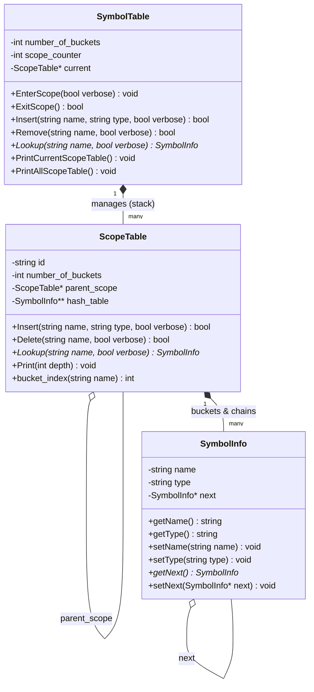
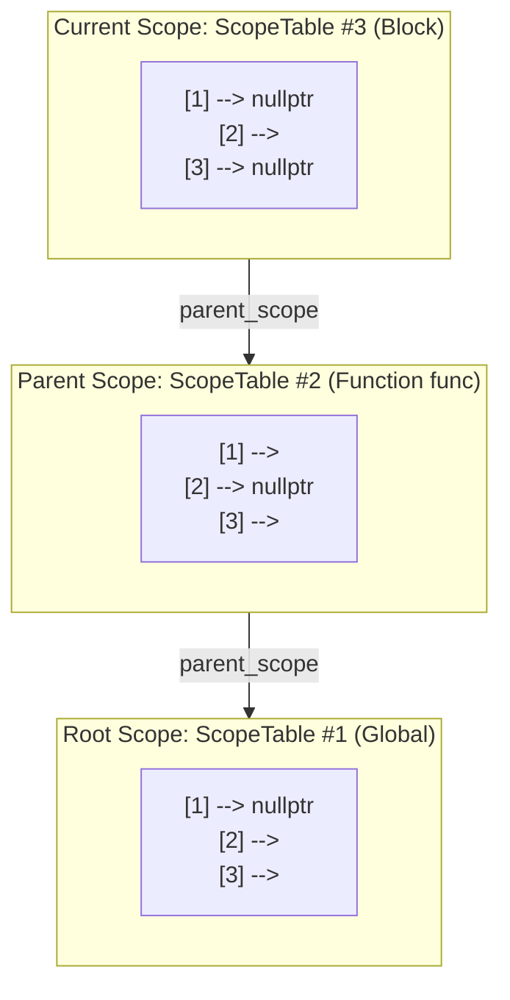

# Scoped Symbol Table Implementation

[](https://en.cppreference.com/w/cpp/17)
[](Makefile)
[](https://github.com/google/sanitizers)
[](https://ubuntu.com/)
[](https://cse.buet.ac.bd/)

A high-performance, memory-safe, hierarchical **Symbol Table** implemented in C++17 for compiler construction. Designed as the core symbol resolution and type-tracking infrastructure for multi-pass compilers, supporting block-structured lexical scoping, open hashing with separate chaining, and structured type introspection.

Developed for **CSE 310: Compiler Sessional**, Department of Computer Science and Engineering, Bangladesh University of Engineering and Technology (BUET).

---

## Table of Contents

- [Overview](#overview)
- [Architecture & Design](#architecture--design)
  - [Class Hierarchy](#class-hierarchy)
  - [Lexical Scoping Model](#lexical-scoping-model)
  - [Core Components](#core-components)
- [Hashing & Collision Handling](#hashing--collision-handling)
- [Command Set & Grammar](#command-set--grammar)
- [Project Structure](#project-structure)
- [Building & Running](#building--running)
  - [Prerequisites](#prerequisites)
  - [Build with Make](#build-with-make)
  - [Build with Shell Script](#build-with-shell-script)
  - [Automated Verification](#automated-verification)
- [Memory Safety & Robustness](#memory-safety--robustness)
- [Complexity Analysis](#complexity-analysis)
- [License & Academic Integrity](#license--academic-integrity)

---

## Overview

A **Symbol Table** is the central data structure in a compiler frontend. It maintains semantic information about identifiers and language entities—such as variables, functions, composite data types (`struct` / `union`), and scope boundaries.

### Key Capabilities
- **Hierarchical Lexical Scoping:** Seamlessly handles nested blocks (`{ ... }`), shadowing outer variables while retaining access to non-shadowed parent declarations.
- **Fast Lookups:** Utilizes the standard SDBM string hash algorithm with collision resolution via separate chaining.
- **Rich Type Annotations:** Automatically serializes and formats complex types, including functions (with argument lists and return types), structures, and unions.
- **Memory Hardened:** Iterative destruction prevents stack overflows on deep chains; rigorously audited with GCC/Clang AddressSanitizer (`-fsanitize=address`) for 0 leaks and 0 invalid memory accesses.
- **Defensive Input Handling:** Resilient against Windows CRLF (`\r\n`) line breaks, uneven spacing, and whitespace-only input records.

---

## Architecture & Design

### Class Hierarchy



### Lexical Scoping Model

The symbol table operates as a dynamic tree/stack of hash tables. Each time a new block is entered (`S`), a new `ScopeTable` is pushed. When the block ends (`E`), the table is popped and cleanly deallocated:



When looking up an identifier:
1. The search starts in **`CurrentScope`**.
2. If not found, it traverses upward via `parent_scope` through **`ParentScope`** to **`RootScope`**.
3. If not found in any scope, a not-found notification is emitted.

---

### Core Components

| Class | Header | Responsibility |
|---|---|---|
| [`SymbolInfo`](include/SymbolInfo.h) | [`include/SymbolInfo.h`](include/SymbolInfo.h) | Holds key-value token information (`name`, `type`) and the `next` collision pointer. Features iterative chain deletion to prevent stack overflow on deep linked lists. |
| [`ScopeTable`](include/ScopeTable.h) | [`include/ScopeTable.h`](include/ScopeTable.h) | Implements an open hash table of size $N$. Contains operations to insert, search, delete, and pretty-print entries within that scope. |
| [`SymbolTable`](include/SymbolTable.h) | [`include/SymbolTable.h`](include/SymbolTable.h) | Encapsulates the entire scope hierarchy. Tracks the current scope, handles `EnterScope` / `ExitScope` transitions, and enforces the rule that root scopes cannot be exited. |

---

## Hashing & Collision Handling

The hash function implemented is the **SDBM** string hashing algorithm:

$$\text{hash} = \Big(\text{str}[i] + (\text{hash} \ll 6) + (\text{hash} \ll 16) - \text{hash}\Big) \pmod{\text{num\_buckets}}$$

```cpp
inline unsigned int SDBMHash(const string& str, unsigned int num_buckets) {
    unsigned int hash = 0;
    unsigned int len = str.length();
    for (unsigned int i = 0; i < len; i++) {
        hash = ((str[i]) + (hash << 6) + (hash << 16) - hash) % num_buckets;
    }
    return hash;
}
```

- **Collision Strategy:** Separate chaining using singly-linked lists.
- **Insertion Policy:** Duplicate detection runs first via lookup; if not found, the new `SymbolInfo` is appended to the tail of the bucket chain (preserving insertion order).

---

## Command Set & Grammar

The symbol table CLI parses lines formatted as `<Command> [Arguments...]`:

| Command | Arguments | Semantic Action | Sample Output |
|:---:|---|---|---|
| **`I`** | `<name> <type>` | Inserts `<name>` into the current scope table. | `Inserted in ScopeTable# 1 at position 7, 1` |
| **`L`** | `<name>` | Searches for `<name>` starting from current to root. | `'foo' found in ScopeTable# 5 at position 7, 2` |
| **`D`** | `<name>` | Deletes `<name>` from the current scope only. | `Deleted '==' from ScopeTable# 5 at position 2, 1` |
| **`P`** | `A` (All) or `C` (Current) | Pretty-prints the scope table(s) with depth indentations. | See below |
| **`S`** | *none* | Enters a new nested scope. | `ScopeTable# 2 created` |
| **`E`** | *none* | Exits current scope. Protected at root scope. | `ScopeTable# 2 removed` |
| **`Q`** | *none* | Quits processing; frees all open scopes. | Destruction log for remaining scopes |

### Formatted Type Representation
- **Functions:** `I foo FUNCTION INT INT FLOAT INT`  
  $\longrightarrow$ `<foo,FUNCTION,INT<==(INT,FLOAT,INT)>`
- **Structures:** `I car STRUCT INT doors STRING brand`  
  $\longrightarrow$ `<car,STRUCT,{(INT,doors),(STRING,brand)}>`
- **Unions:** `I item UNION INT id FLOAT val`  
  $\longrightarrow$ `<item,UNION,{(INT,id),(FLOAT,val)}>`
- **Variables & Literals:** `I count VAR`, `I 42 NUMBER`  
  $\longrightarrow$ `<count,VAR>`, `<42,NUMBER>`

---

## Project Structure

```
.
├── include/                     # C++ Header declarations
│   ├── SymbolInfo.h             # Symbol token representation
│   ├── ScopeTable.h             # Individual scope hash table
│   └── SymbolTable.h            # Hierarchical scope manager
├── src/                         # Implementation
│   └── main.cpp                 # Command interpreter and driver
├── test/                        # Test suite & verification
│   ├── input.txt                # Comprehensive test input
│   └── sample_output.txt        # Golden sample output
├── docs/                        # Specifications & course resources
│   ├── SymbolTableSpec.pdf      # Detailed assignment specifications
│   ├── January 2026 CSE310...pdf
│   └── January 2026 CSE310...pptx
├── Makefile                     # Standard GNU Make build rules
├── build.sh                     # Automated build & verification script
├── .gitignore                   # Ignores binaries, objects & large media
└── README.md                    # Project documentation
```

---

## Building & Running

### Prerequisites
- **C++ Compiler:** GCC $\ge$ 9.0 or Clang $\ge$ 10.0 (C++17 support required).
- **Build Tools:** GNU `make` and `bash`.
- **Platform:** Linux / macOS / WSL (Windows Subsystem for Linux).

### Build with Make

```bash
# Build the binary with AddressSanitizer enabled
make

# Run against default test files
make run

# Run and automatically diff against golden sample output
make test

# Clean artifacts
make clean
```

### Build with Shell Script

```bash
chmod +x build.sh
./build.sh [optional_input.txt] [optional_output.txt]
```

### Manual Compilation

```bash
g++ -std=c++17 -Wall -Wextra -fsanitize=address -g -Iinclude src/main.cpp -o symbol_table

# Run with arguments
./symbol_table test/input.txt output.txt

# Or run with standard I/O redirection
./symbol_table < test/input.txt > output.txt
```

### Automated Verification

To verify that output matches the course benchmark byte-for-byte:
```bash
./symbol_table test/input.txt test/output.txt
diff -u test/output.txt test/sample_output.txt && echo "100% Match!"
```

---

## Memory Safety & Robustness

- **AddressSanitizer Clean:** Compiled and tested with `-fsanitize=address -g`. Guarantees **0 leaks**, 0 out-of-bounds accesses, and 0 use-after-free conditions upon termination.
- **Stack Overflow Immunity:** Linked list node deallocations inside `~SymbolInfo()` are performed iteratively rather than recursively, preventing runtime stack exhaustions on deep collision chains.
- **Copy Semantics Deleted:** The Rule of Five copy constructor and copy assignment operators are explicitly `= delete`d across all classes to prohibit accidental pointer aliasing and double-free faults.
- **Root Scope Guard:** Any attempt to pop the root global scope (`E`) is safely rejected without crash or invalid state.
- **Windows CRLF Tolerance:** Input lines ending in `\r\n` are sanitized automatically on Linux runtimes.
- **Safe Parsing:** Token streams guard against uninitialized variables on whitespace-only lines.

---

## Complexity Analysis

Let $N$ be the number of buckets and $M$ be the number of symbols currently stored in a scope table:

| Operation | Average Case | Worst Case (all collide) | Space Complexity |
|---|:---:|:---:|:---:|
| **`Insert`** | $\mathcal{O}(1 + \alpha)$ | $\mathcal{O}(M)$ | $\mathcal{O}(1)$ |
| **`Lookup` (Current Scope)** | $\mathcal{O}(1 + \alpha)$ | $\mathcal{O}(M)$ | $\mathcal{O}(1)$ |
| **`Lookup` (Across $K$ Scopes)** | $\mathcal{O}(K \cdot (1 + \alpha))$ | $\mathcal{O}(K \cdot M)$ | $\mathcal{O}(1)$ |
| **`Delete`** | $\mathcal{O}(1 + \alpha)$ | $\mathcal{O}(M)$ | $\mathcal{O}(1)$ |
| **`EnterScope` / `ExitScope`** | $\mathcal{O}(N)$ | $\mathcal{O}(N)$ | $\mathcal{O}(N)$ |
| **`Print`** | $\mathcal{O}(N + M)$ | $\mathcal{O}(N + M)$ | $\mathcal{O}(1)$ aux |

*(where $\alpha = M / N$ is the load factor of the hash table).*

---

## License & Academic Integrity

This project is part of the academic curriculum for **CSE 310 (Compiler Sessional)** at BUET. It is made available for educational and portfolio demonstration purposes.
