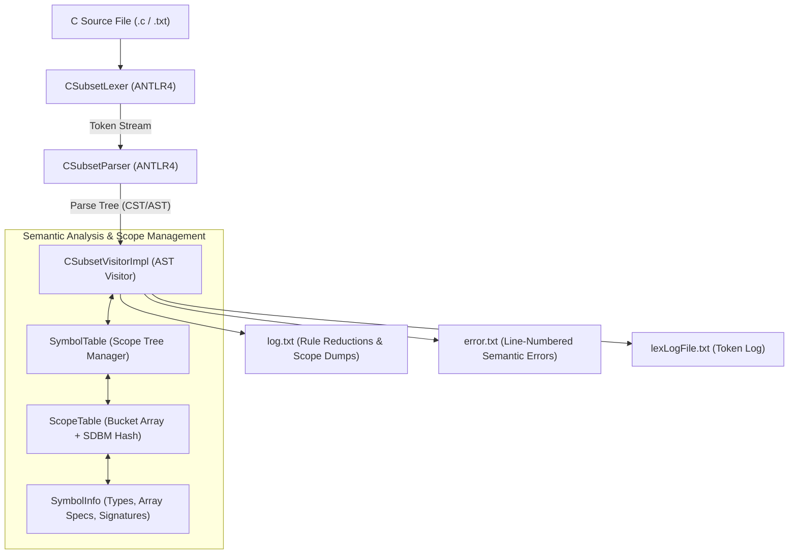

# C Subset Syntax & Semantic Analyzer

[](https://en.cppreference.com/w/cpp/17)
[](https://www.antlr.org/)
[]()
[]()
[](LICENSE)

A robust syntax and semantic analyzer for a subset of the **C programming language**, built using **ANTLR4** (C++ runtime) and the **Visitor Design Pattern**. The compiler front-end constructs an abstract parse tree, maintains a dynamically scoped hash-based symbol table, validates type consistency and scope rules, and reports detailed line-by-line syntax and semantic diagnostics.

Developed for **CSE 310: Compiler Sessional**, Department of Computer Science & Engineering, Bangladesh University of Engineering & Technology (BUET).

---

## Architecture Overview



---

## Key Features

### 1. Language Grammar & Syntax Analysis
- **Parser & Lexer Separation**: Implemented via modular ANTLR4 grammars [`grammar/CSubset.g4`](grammar/CSubset.g4) and [`grammar/Lexer.g4`](grammar/Lexer.g4).
- **Ambiguity Resolution**: Standard operator precedence and associativity rules (arithmetic, relational, logical, ternary, and assignment), with ambiguity resolution for the classical *dangling-else* problem.
- **Syntax Error Recovery**: Grammatical productions designed to handle missing semicolons, malformed parameter lists, and invalid expressions while preserving tree navigation.

### 2. Hierarchical Symbol Table & Scoping
- **Parent-Pointer Tree**: Implements nested scopes with automatic hierarchical ID generation (`1`, `1.1`, `1.2`, `1.2.1`).
- **SDBM Hash Table**: Fast $O(1)$ expected lookup and insertion using separate chaining with memory-safe iterative pointer destruction.
- **Rich Metadata**: [`SymbolInfo`](include/SymbolInfo.h) stores variable types, array bounds, function signatures (return type, parameter types, parameter names), and definition/declaration state.

### 3. Semantic Validation & Type Checking
- **Type Compatibility**: Validates operand types for arithmetic, assignment (`=`), and logical operators.
- **Integral Modulus Check**: Ensures both operands of `%` are strictly integers.
- **Division/Modulus by Zero**: Static detection of division or modulus by literal zero, signed zero (`+0`, `-0`), and parenthesized zero (`(0)`).
- **Array Subscript Checking**: Enforces integer index expressions on arrays and prevents subscripting non-array identifiers.
- **Function Integrity**:
  - Declaration vs. definition consistency (matching return type, parameter count, order, and types).
  - Validation of function invocation arguments against formal parameters.
  - Prevention of `void` function calls inside value-bearing expressions.
- **Scope & Declaration Safety**:
  - Detects duplicate identifier declarations within the same scope.
  - Flags undeclared identifiers used in expressions or function calls.

---

## Repository Structure

```
.
├── grammar/
│   ├── CSubset.g4                 # Parser grammar rules and AST structure
│   └── Lexer.g4                   # Token specifications and keywords
├── include/
│   ├── CSubsetVisitorImpl.h       # Visitor class header traversing ANTLR parse tree
│   ├── ScopeTable.h               # Scoped hash table implementation
│   ├── SymbolInfo.h               # Token metadata, variable, and function descriptors
│   └── SymbolTable.h              # Multi-scope symbol table manager
├── src/
│   ├── CSubsetVisitorImpl.cpp     # Full semantic rules and error diagnostics
│   └── main.cpp                   # Compiler entry point and token stream setup
├── test/
│   ├── input1.txt .. input5.txt   # Test C programs (valid programs, syntax & semantic errors)
│   ├── log1.txt .. log5.txt       # Golden grammar reduction logs and scope table dumps
│   └── error1.txt .. error5.txt   # Golden diagnostic error logs
├── docs/
│   ├── AntlrSpec.pdf              # Official BUET Assignment 3 specification
│   ├── Class_Lecture.pdf          # Lecture slides on Syntax and Semantic Analysis
│   ├── Getting_Started_with_ANTLR4.pdf
│   └── Terence Parr - The Definitive ANTLR 4 Reference...pdf
├── submission/
│   ├── 2205119/                   # Original unbundled submission directory
│   └── 2205119.zip                # Official submission archive
├── Makefile                       # Automated build, test, and cleanup rules
├── build.sh                       # Quick build & test runner
└── .gitignore                     # Git rules ignoring binaries, generated code, and >100MB media
```

> [!NOTE]
> Large media files (such as `Antlr.mp4`, 258MB) are excluded via `.gitignore` to comply with GitHub's 100MB file limit.

---

## Prerequisites

- **C++ Compiler**: GCC `g++` (version 9+ supporting C++17)
- **ANTLR4 Runtime**: `libantlr4-runtime-dev` (version 4.13.x installed in `/usr/local/include/antlr4-runtime` and `/usr/local/lib`)
- **ANTLR Tool**: `antlr4` CLI tool (or local virtual environment at `antlr4_venv/bin/antlr4`)
- **Make**: GNU Make

---

## Build & Execution

### 1. Build the Compiler
To generate the ANTLR visitor/lexer files and compile the executable:
```bash
make all
```

### 2. Run on a Custom File
```bash
./compiler.out test/input1.txt
```
Or using Make:
```bash
make run INPUT=test/input1.txt
```

Generated outputs:
- `log.txt`: Matching grammar reductions and symbol table scope dumps.
- `error.txt`: Line-numbered semantic and syntax error diagnostics.
- `lexLogFile.txt`: Token output stream.

### 3. Run the Automated Test Suite
To execute all 5 reference test cases and verify zero diff against golden logs:
```bash
make test
```
Or execute the helper script:
```bash
./build.sh
```

### 4. Clean Build Artifacts
```bash
make clean
```

---

## Test Suite Validation

The compiler has been verified against all 5 official benchmark cases:

| Test Case | Description | Result |
| :--- | :--- | :---: |
| `input1.txt` | Valid C program with functions, loops, expressions, arrays | **PASS** |
| `input2.txt` | Syntax and grammar recovery (missing semicolons, malformed constructs) | **PASS** |
| `input3.txt` | Complex nested scopes, function definitions, arithmetic operations | **PASS** |
| `input4.txt` | Deep semantic checks (type mismatch, argument mismatches, void checks) | **PASS** |
| `input5.txt` | Division/modulus by zero (`(0)`, `+0`, `-0`), undeclared variable detection | **PASS** |

---

## Author
- **Saif (2205119)** - Department of Computer Science & Engineering, BUET
